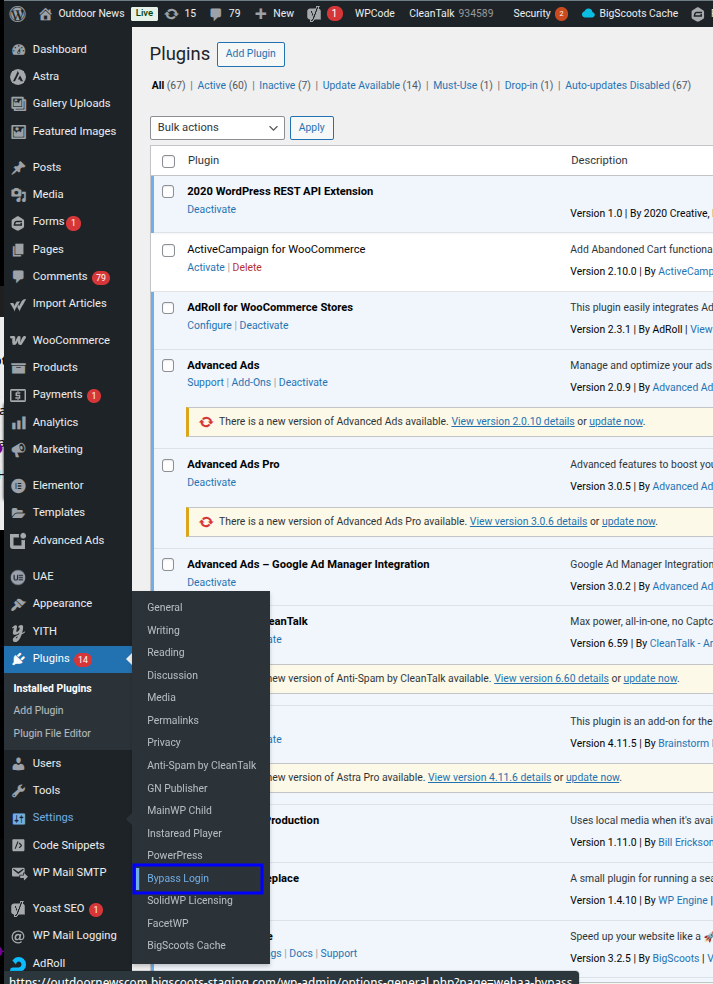
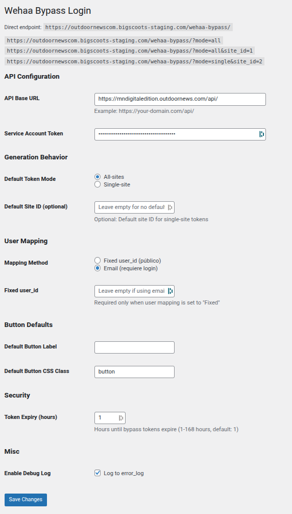

# Wehaa Bypass Login — WordPress Plugin Documentation (v1.3.5)

> **Who this guide is for:** Outdoor News — MN Digital Edition  
> **Goal:** Configure the plugin **exactly like the screenshots**, so readers can be redirected to NPaper using bypass tokens.

---

## Quick Start (Do this first)

1. Log in to WordPress as an administrator.  
2. Open **Settings → Bypass Login**.

   

3. Configure every field **exactly** as shown below, then click **Save Changes**.

   

### Exact Values to Match the Screenshot

| Section | Field | Value |
|---|---|---|
| **API Configuration** | **API Base URL** | `https://mndigitaledition.outdoornews.com/api/`<br><sub>(Paste the API Base URL provided by Wehaa — keep it secret)</sub> |
|  | **Service Account Token** | *(Paste the token provided by Wehaa — keep it secret)* |
| **Generation Behavior** | **Default Token Mode** | **All-sites** |
|  | **Default Site ID** | *(Leave empty)* |
| **User Mapping** | **Mapping Method** | **Email (requires login)** |
|  | **Fixed user_id** | *(Leave empty)* |
| **Button Defaults** | **Default Button Label** | *(Leave empty, or set your preferred label)* |
|  | **Default Button CSS Class** | `button` |
| **Security** | **Token Expiry (hours)** | `1` |
| **Misc** | **Enable Debug Log** | ✅ **Log to error_log** *(for setup; see Debug section for v1.3.5 controls)* |

---

## Overview

The **Wehaa Bypass Login** plugin integrates WordPress with the Django **NPaper** subscription system. It generates short-lived bypass tokens and redirects readers straight to NPaper content without a manual login.

## Key Features

- **Direct Endpoint Access**: `/wehaa-bypass` for server-side generation + redirect  
- **Shortcode Support**: `[bypass_access_button]` to place a button anywhere  
- **Multiple Token Types**: **single-site** or **all-sites**  
- **User Mapping**: by **email** (recommended) or **fixed user ID**  
- **Enhanced Security**: service token auth + session/user-agent/IP validation  
- **Environment-Aware Debug System (v1.3.5)**: production vs. development modes  
- **Automatic Data Sanitization** in debug logs (development only)

---

## Installation

1. Upload the plugin folder to `/wp-content/plugins/`.  
2. Activate it in **Plugins**.  
3. Open **Settings → Bypass Login** and configure as above.

---

## Configuration

### API Configuration

**Base URL** (`base_url`)  
- **Use exactly:** `https://mndigitaledition.outdoornews.com/api/`  
- *(Paste the API Base URL provided by Wehaa — keep it secret)*  
- **Required**

### Generation Behavior

**Default Token Mode** (`mode`)  
- `all` (default): all-sites token with site selection page.  
- `single`: single-site token for direct access.

**Default Site ID** (`default_site_id`)  
- Numeric ID used when creating single-site tokens.  
- Required only if `mode` = `single`.

### User Mapping

**Mapping Method** (`user_mapping`)  
- `email` (recommended) or `fixed`.

**Fixed User ID** (`fixed_user_id`)  
- Only when `user_mapping` = `fixed`.

### Display Options

- **Button Label** (`button_label`) – default: “Continue to Digital Edition”.  
- **Button CSS Class** (`button_class`) – default: `btn btn-primary`.

### Token Configuration

- **Token Expiry Hours** (`token_expiry_hours`) – 1–720 hours (empty = infinite).

### Security & Debug (v1.3.5)

**Environment Mode** (`environment`)  
- `production` (default): **debug logging disabled** (maximum security).  
- `development`: debug allowed with sanitization.

**Debug Level** (`debug_level`) *(development only)*  
- `none` (default), `basic` (safe info), `verbose` (detailed, sanitized).

---

## Usage Methods

### 1) Direct Endpoint

```
https://your-wordpress-site.com/wehaa-bypass?mode={all|single}&site_id={ID}
```

**Examples (as in screenshot):**
```
https://outdoornewscom.bigscoots-staging.com/wehaa-bypass/?mode=all
https://outdoornewscom.bigscoots-staging.com/wehaa-bypass/?mode=all&site_id=1
https://outdoornewscom.bigscoots-staging.com/wehaa-bypass/?mode=single&site_id=2
```

### 2) Shortcode

Basic:
```
[bypass_access_button]
```

With options:
```
[bypass_access_button mode="single" site_id="1" label="Access Site 1" class="custom-btn"]
```

**Parameters**: `mode`, `site_id`, `label`, `class`.

---

## Security Features

- **Session ID** validation  
- **User-Agent** + **IP** hashing (SHA-256)  
- **Audit Trail** with WP user context  
- Requests include token auth, fingerprinting, and timestamps.

### Environment-Based Security (v1.3.5)

**Production (Default)**  
- Debug **cannot** be enabled. No sensitive data can be logged.

**Development**  
- Debug allowed with **automatic sanitization**:
  - Tokens/API Keys: `12345678***HIDDEN***`
  - Passwords: hidden
  - Emails (basic level): `use***@domain.com`

---

## Error Handling

- **No user found with email and bypass_login=1** → ensure user exists and `bypass_login=True`.  
- **API request failed** → verify service token and API base URL.  
- **Invalid site_id** → confirm site exists in Django.  
- **User not authorized for bypass** → enable `bypass_login` for that user.

---

## Debug Logging (v1.3.5)

**Location:** **Settings → Bypass Login → Debug & Development**

### Production (recommended for live)
```
Environment: Production
Debug Level: None (forced)
```
- No logging overhead; safest for live sites.

### Development (local/staging)
```
Environment: Development
Debug Level: None | Basic | Verbose
```

**Enable WP log (development only)** – add to `wp-config.php`:
```php
define('WP_DEBUG', true);
define('WP_DEBUG_LOG', true);
define('WP_DEBUG_DISPLAY', false); // Hide from frontend
```

**Logs**  
- `/wp-content/debug.log` (if enabled) or server error log.  
- Format: `[Wehaa Bypass] [TIMESTAMP] [LEVEL] MESSAGE | Data: {...}`

> **IMPORTANT:** Switch back to **Production** after debugging.

---

## Performance Notes

- Tokens are **not cached**; each request generates a new token.  
- Consider rate limiting on high-traffic sites.

---

## API Reference

**Plugin Settings Array (v1.3.5)**
```php
$options = get_option('wehaa_bypass_options', [
    'base_url'           => '',
    'service_token'      => '',
    'mode'               => 'all',
    'default_site_id'    => '',
    'user_mapping'       => 'email',
    'fixed_user_id'      => '',
    'button_label'       => 'Continue to Digital Edition',
    'button_class'       => 'btn btn-primary',
    'token_expiry_hours' => '',
    'environment'        => 'production', // production | development
    'debug_level'        => 'none'        // none | basic | verbose (dev only)
]);
```

---

## Support

1. If needed on staging, enable development mode and **basic** debug.  
2. Check WordPress and server error logs.  
3. Verify API connectivity to Django.  
4. Re-check each setting against the **screenshots** above.

---

*This plugin is proprietary software developed by Wehaa for integration with the NPaper subscription system.*
